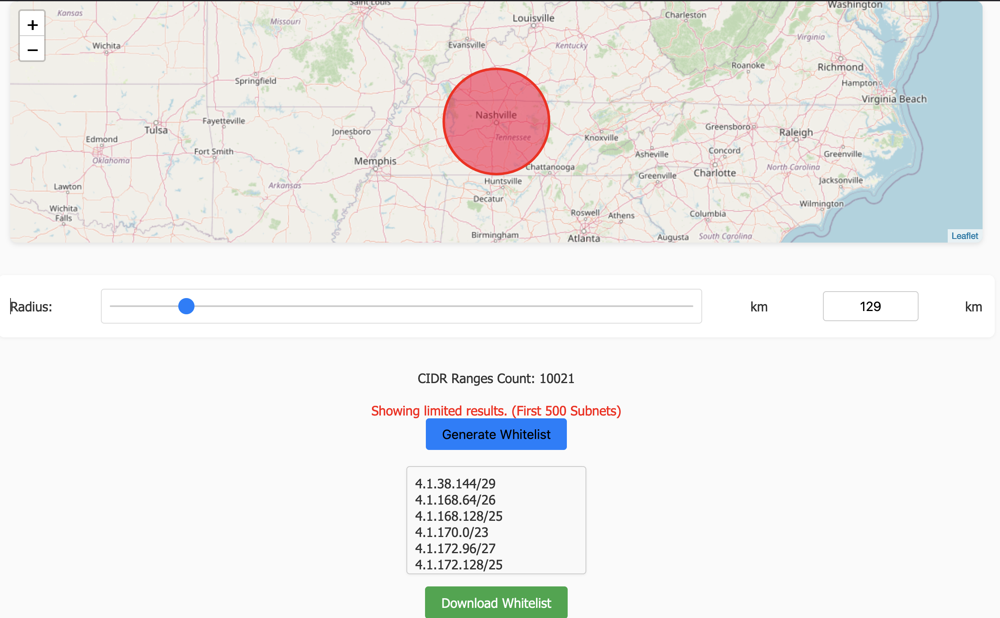

# Region2IPs

This tool generates a whitelist of CIDR subnets within a specified radius from a target location. It includes a web interface for easy interaction and visualization.



## Features

- **Distance Calculation:** Computes the distance between geographical coordinates using the Haversine formula.
- **Whitelist Generation:** Generates a list of CIDR subnets within a specified radius from a target location.
- **Web Interface:** Interactive web interface to set parameters and view results.

## Installation

1. **Clone the Repository:**
    ```sh
    git clone <repository_url>
    cd <repository_directory>
    ```

2. **Install Dependencies:**
    ```sh
    pip install -r requirements.txt
    ```

3. **Download Geolocation Data:**
    - Place the `GeoLite2-City-CSV_20240220/GeoLite2-City-Blocks-IPv4.csv` file in the root directory.

## Running the Web Application

1. **Start the Flask App:**
    ```sh
    python app.py
    ```

2. **Access the Web Interface:**
    - Open your browser and navigate to `http://localhost:8888`.

## Usage

### Web Interface

- **Set Location and Radius:**
  - Use the interface to set the target location (latitude and longitude) and the maximum distance (radius in kilometers).
  
- **Generate Whitelist:**
  - Click the button to generate the whitelist. The results will be displayed and saved in `static/full_whitelist.txt`.

## Notes

- **Large Radius Warning:** Generating a whitelist with a large radius may take significant time and result in large output files. The web interface limits the displayed results to the first 500 entries to prevent crashes.
